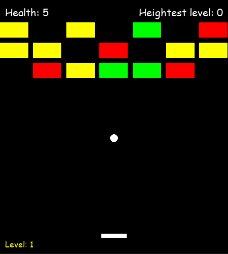

# BREAKING BLOCK GAME
the goal of this game is to destroy the block to gain score in order to level up.

## Table of contents
  - [Table of contents](#table-of-contents)
  - [How to install the game](#how-to-install-the-game)
  - [How to play the game](#how-to-play-the-game)
  - [Special effect](#special-effect)
  - [Credit](#credit)

## How to install the game
- [game install](https://www.markdownguide.org/extended-syntax/)
- [git hub]()

## How to play the game
- For movement use **wasd** keys
- For summon the ball use **left shift**
- For pause use **Esc**
- In Game over menu you can use **Esc** key to exite to main menu or press any key to continue playing
- game did not save the level when closed but it still save the heighest level when restart the game play
- different color of block have different score
    - red = 100
    - yellow = 80
    - green = 50
- different color of block have different health
    - red = 3
    - yellow = 2
    - green = 1
- different color of ball have different damage
    - white = 1
    - red = 3 (*red ball can be summon by collect the special effect*)

## Special effect
|    image    | Description |
| ----------- | ----------- |
|| increas the lenght of player for limited times|
|| summon the special ball that have more damage than normal ball|
|| increas health for player|
|| decreas health for player|
|| create protection platform that bounce the ball for limited times|

## Credit
everything by mooton100kg\
(sorry for my bad english and the chaotic code)

*__**this game not gonna be debuged or updated any time soon so no need for bug report thank you.**__*
